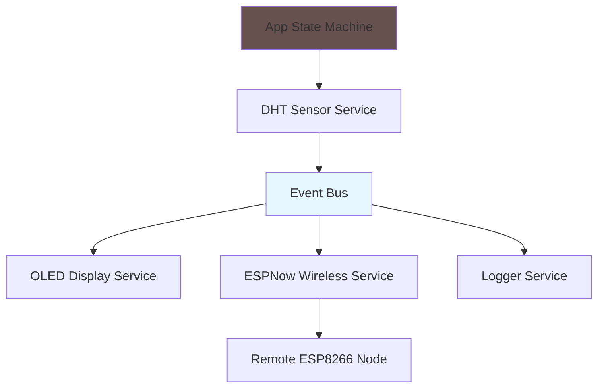
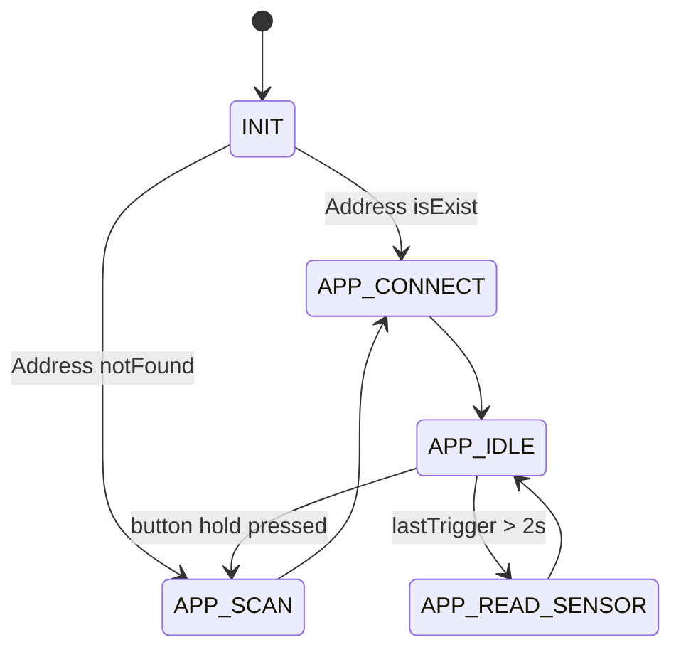
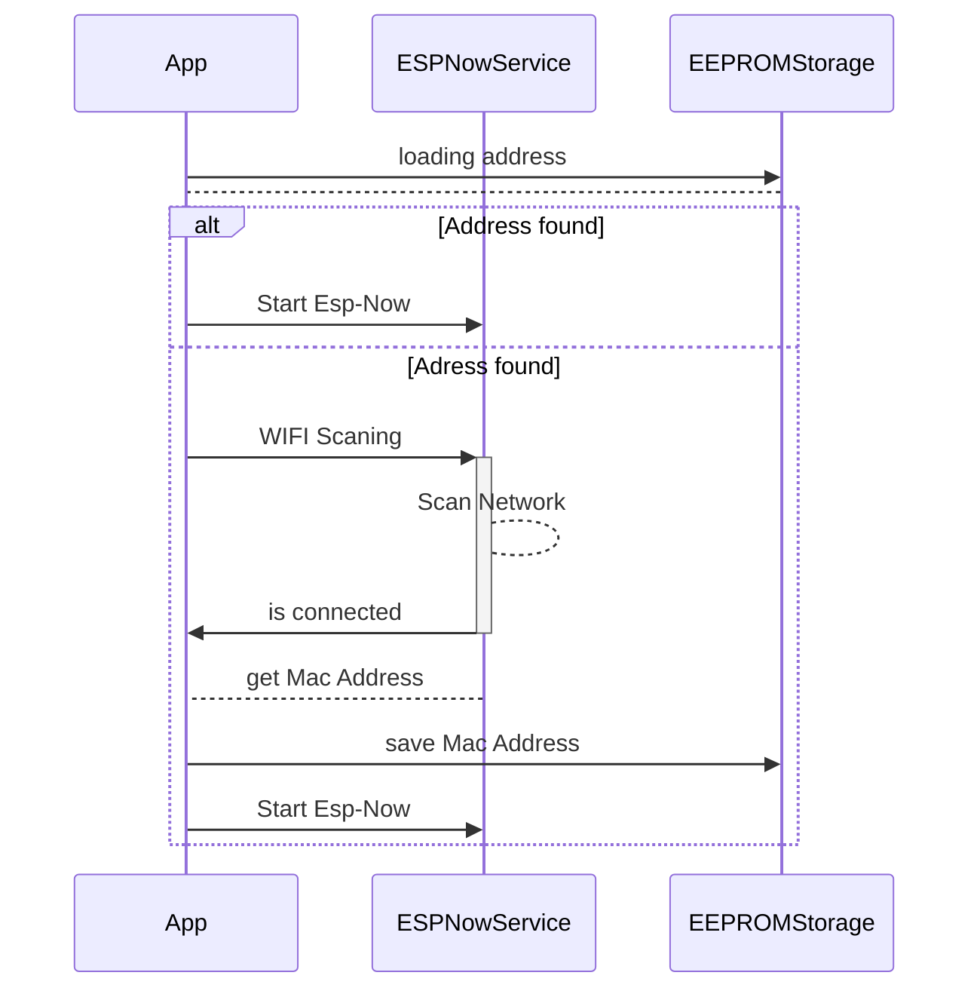
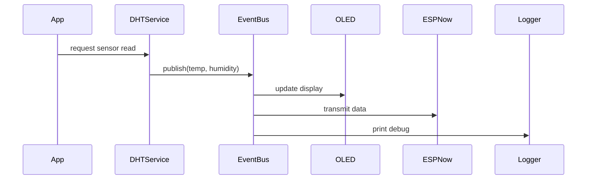

# Weather Data Center – ESP8266

Embedded weather monitoring firmware running on **ESP8266** using a **Finite State Machine** and **Event-Driven architecture**.

The firmware is built with **Arduino CLI** and designed to be modular and extensible for IoT applications.

---

# Architecture

The system follows a **State Machine + Event Bus** architecture.

The **State Machine** controls application flow, while services communicate through an **event dispatcher**.

This ensures:

* loose coupling
* modular services
* non-blocking firmware
* easy feature expansion

---

# Architecture Diagram



### Components

| Component     | Responsibility                 |
| ------------- | ------------------------------ |
| App FSM       | Controls firmware lifecycle    |
| DHTService    | Reads temperature and humidity |
| Event Bus     | Dispatches sensor events       |
| OLEDService   | Displays readings              |
| ESPNowService | Sends readings wirelessly      |
| Logger        | Serial debugging               |

Wireless communication uses **ESP-NOW**.

---

# Application State Machine

The application logic runs inside a **Finite State Machine (FSM)**.

### States

| State       | Description           |
| ----------- | --------------------- |
| INIT        | Initialize services   |
| IDLE        | Wait for next reading |
| READ_SENSOR | Acquire sensor data   |
| ERROR       | Error handling        |

### State Flow



The loop is non-blocking and relies on `millis()` timers.

---

# ESP-NOW Flow Sequence

The system uses a **publish / subscribe model**.

When sensor data is available, it is broadcast to all services.



# Event Flow Sequence



Advantages:

* multiple consumers for one event
* services are independent
* easy to extend

---

# Project Structure

```
weather_Data_Center/
│
├── app/
│   ├── App.cpp
│   ├── Event.cpp
│   └── Logger.cpp
│
├── sensors/
│   └── DHTService.cpp
│
├── display/
│   └── OLEDService.cpp
│
├── wireless/
│   └── ESPNowService.cpp
│
└── weather_Data_Center.ino
```

---

## 2. Subscribe to Events

Register the service in the application initialization.

```cpp
Event::subscribe(MQTTService::onSensor);
```

Now the service automatically receives sensor updates.

---

## 3. Initialize the Service

Add initialization inside `App::init()`.

```cpp
MQTTService::init();
```

Done.
The new service now reacts to sensor events without modifying existing modules.

---

# Design Principles

The firmware follows key embedded design principles:

* Event-driven programming
* Finite State Machine control
* Non-blocking execution
* Modular services
* Hardware abstraction

This architecture allows future extensions such as:

* MQTT telemetry
* OTA firmware updates
* Web dashboard
* SD card logging
* multi-node sensor networks

---

# 1. Install Arduino CLI

### Linux / macOS

```bash
curl -fsSL https://raw.githubusercontent.com/arduino/arduino-cli/master/install.sh | sh
```

Move it to your PATH:

```bash
sudo mv bin/arduino-cli /usr/local/bin/
```

### Windows

Download Arduino CLI from:
https://arduino.github.io/arduino-cli/latest/installation/

Verify installation:

```bash
arduino-cli version
```

---

# 2. Initialize Arduino CLI

Run:

```bash
arduino-cli config init
```

This creates the configuration file:

```
~/.arduino15/arduino-cli.yaml
```

Update the board manager URL for ESP8266.

Example configuration:

```yaml
board_manager:
  additional_urls:
    - https://arduino.esp8266.com/stable/package_esp8266com_index.json
```

---

# 3. Install ESP8266 Core

Update the index:

```bash
arduino-cli core update-index
```

Install ESP8266 support:

```bash
arduino-cli core install esp8266:esp8266
```

Verify installation:

```bash
arduino-cli core list
```

---

# 4. Install Required Libraries

Install project dependencies:

```bash
arduino-cli lib install "ESP8266WiFi"
arduino-cli lib install "ArduinoJson"
arduino-cli lib install "DHTesp"
arduino-cli lib install "Adafruit_SH110X"


```

You can also install libraries automatically if they are listed in the project.

---

# 5. Compile the Project

Navigate to the project folder and run:

```bash
arduino-cli compile \
  --fqbn esp8266:esp8266:nodemcuv2 \
  --build-property compiler.cpp.extra_flags="-Iapp -Idisplay -Iio -Isensors -Iwireless -Istorage" \
  -v .
arduino-cli compile --fqbn esp8266:esp8266:nodemcuv2 .
```

Example board types:

| Board           | FQBN                        |
| --------------- | --------------------------- |
| NodeMCU         | `esp8266:esp8266:nodemcuv2` |
| Wemos D1 Mini   | `esp8266:esp8266:d1_mini`   |
| Generic ESP8266 | `esp8266:esp8266:generic`   |

---

# 6. Upload to the Board

Connect your ESP8266 via USB and check the port:

```bash
arduino-cli board list
```

Upload firmware:

```bash
arduino-cli upload -p /dev/ttyUSB0 --fqbn esp8266:esp8266:nodemcuv2
```
---

# 7. Monitor Serial Output

```bash
arduino-cli monitor -p /dev/ttyUSB0 -c baudrate=115200
```

---

# License

Non-commercial license.
See `LICENSE` file for details.
